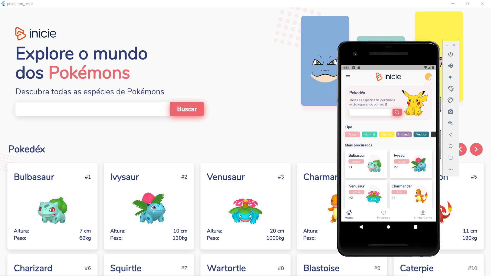

# Pokemon API | Teste de Avaliação

> O projecto foi feito de acordo com aquilo que foi pedido na descrição do teste.

### Funcionalidades
- Responsivo para todos os devices
- Listar pokémons
- Listar pokémons pelo tipo ou categoria
- Apresentar pokémon pelo seu ID
- Pesquisar Pokémon pelo nome ou ID

